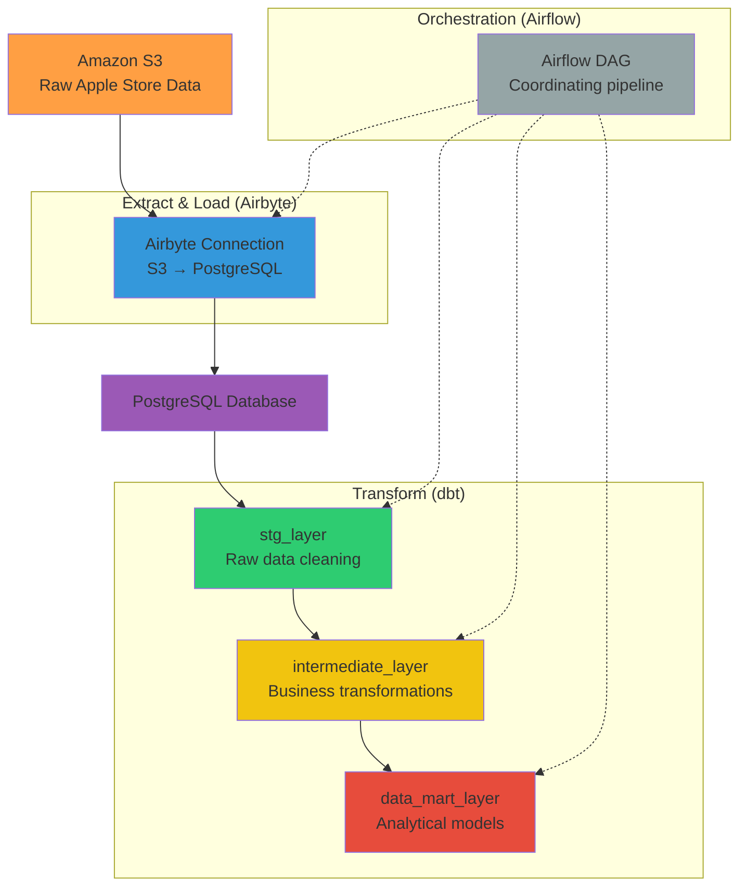

# AppStore Analytics ETL Pipeline

## 📋 Описание проекта
Автоматизированный ETL-pipeline для анализа данных Apple Store. Данные из S3 загружаются через Airbyte в PostgreSQL, где преобразуются с помощью dbt в многослойную витрину данных. Весь процесс оркестрируется через Airflow.

## 🏗️ Архитектура системы

### Схема данных pipeline


## 🧩 Компоненты системы

### 🔹 Источники данных
- **Amazon S3** - хранение сырых данных Apple Store

### 🔹 Загрузка данных (EL)
- **Airbyte** - синхронизация данных из S3 в PostgreSQL
- **Коннекторы**: S3 → PostgreSQL

### 🔹 Хранилище данных
- **PostgreSQL** - используется как DWH для хранения преобразованных данных

### 🔹 Трансформация данных (T)
- **dbt** - преобразование данных через три слоя:
  - **stg_layer** - очистка и стандартизация сырых данных
  - **intermediate_layer** - бизнес-трансформации и джойны
  - **data_mart_layer** - готовые аналитические модели

### 🔹 Оркестрация
- **Airflow** - управление всем ETL-пайплайном
- **DAGs** - автоматизация выполнения задач


## 🚀 Быстрый старт

1. **Клонирование репозитория**
```bash
git clone <repository-url>
cd appstore-analytics-pipeline
```
2. **Выполняем команду**
```bash
# Создание виртуального окружения
python -m venv venv

# Активация (Windows)
venv\Scripts\activate

# Активация (Linux/Mac)
source venv/bin/activate

# Установка зависимостей
pip install -r requirements.txt
```
3. **Выполняем команды для сборки docker compose**
```bash
docker compose build
docker compose up -d
```
4. **Предварительно создаем БД apple_dwh и открываем sql редактор в этой БД и выполняем дальнейший скрипт**

```sql
select * from pg_catalog.pg_available_extensions;

create extension postgres_fdw;

drop server if exists data_db_pg cascade;
create server data_db_pg foreign data wrapper postgres_fdw options (
	host 'localhost',
	dbname 'data_db',
	port '5432'
);

create user mapping for postgres server data_db_pg options (
	user 'postgres',
	password 'postgres'
);

drop schema if exists data_db_src;
create schema data_db_src authorization postgres;
import foreign schema public from server data_db_pg into data_db_src;
```
4. **Запускае скрипт parser_apple_prod.py**

```bash
python parser_apple_prod.py
```
5. **Создаем profiles.yml**
```bash
# Создаем директорию для dbt (если еще не создана)
mkdir -p ~/.dbt/

# Создаем файл profiles.yml
touch ~/.dbt/profiles.yml
```
6. **Добавьте в файл следующую конфигурацию**
```yml
dbt_models:
  outputs:
    dev:
      dbname: apple_dwh
      host: localhost
      pass: postgres
      port: 5433
      schema: intermediate
      threads: 2
      type: postgres
      user: postgres
  target: dev

```
7. **Создаем подключения в airbyte**
8. **Создаем подключения к airbyte в airflow**
9. **В dag airbyte_conn_to_pg.py меняем connection_id на свои**

```python
# ДОЛЖНО БЫТЬ 3 РАЗНЫХ CONNECTION_ID!
PRODUCTS_CONNECTION_ID = 'b5785a9b-fee9-4912-92d4-3e4b4abb06e5' # меняем на свои
SALES_CONNECTION_ID = 'a4df1c6f-fae5-4cab-9635-ec16f571da7e'  # меняем на свои
CUSTOMERS_CONNECTION_ID = '1b6dc6c4-4f7d-4644-bfc5-f3fdfda6540a' # меняем на свои

```
10. **Запускаем даги**